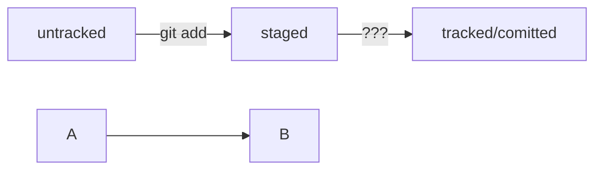

# Тренировочный проект по работе с *git*

----
**readme должен содержать:**
Название проекта и его краткое описание: кем создан,  для чего, какие решает задачи и какие закрывает проблемы.
Технологии, которые применяются в проекте. В чём его отличие от аналогичных.
Документация проекта — подробная инструкция о том, что представляет собой проект.
Планы проекта, если они есть.


HEAD -- это голова.
Коммит -- это всему голова.
Статусы файлов:
<тут пустая строка!>




# Шпаргалка markdown

## Выделение текста

Вы можете выделять текст в markdown с помощью символов `_` или `*`. Например:

Пример _курсива_ и **жирного** текста.

## Заголовки

Заголовки можно создавать с помощью символа `#`. Чем больше `#`, тем меньше заголовок. Например:

# Заголовок первого уровня
## Заголовок второго уровня
### Заголовок третьего уровня

## Выделение кода

Чтобы выделить текст как код, поместите его в тройные кавычки `````. 

```
mkdir my_project
cd my_project
git init
```
Это лишь некоторые функции markdown. 